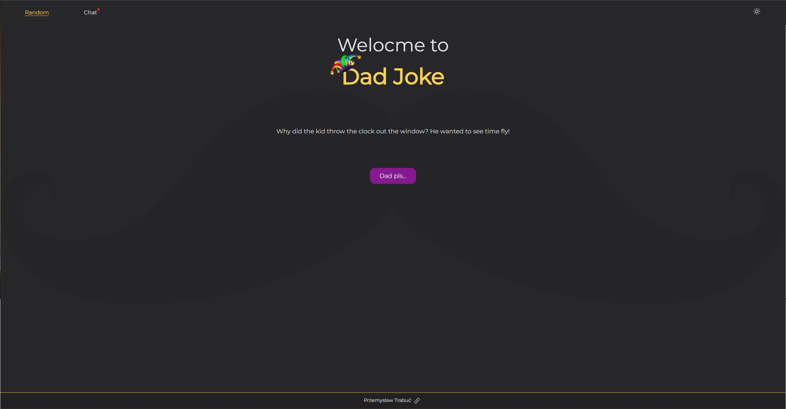
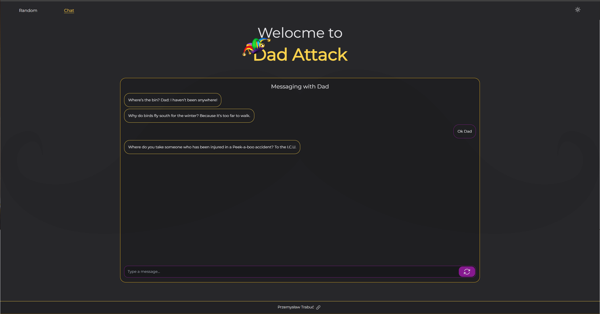
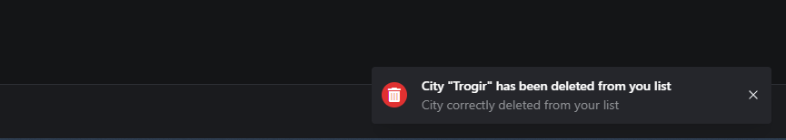
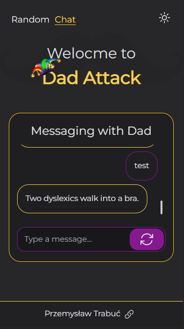
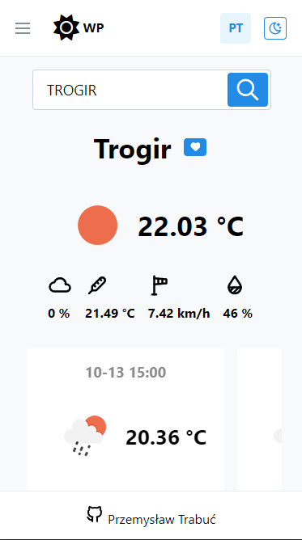
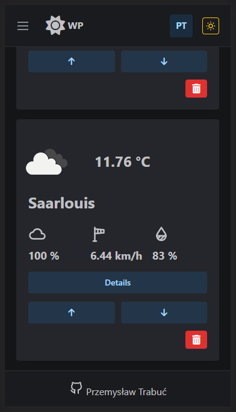
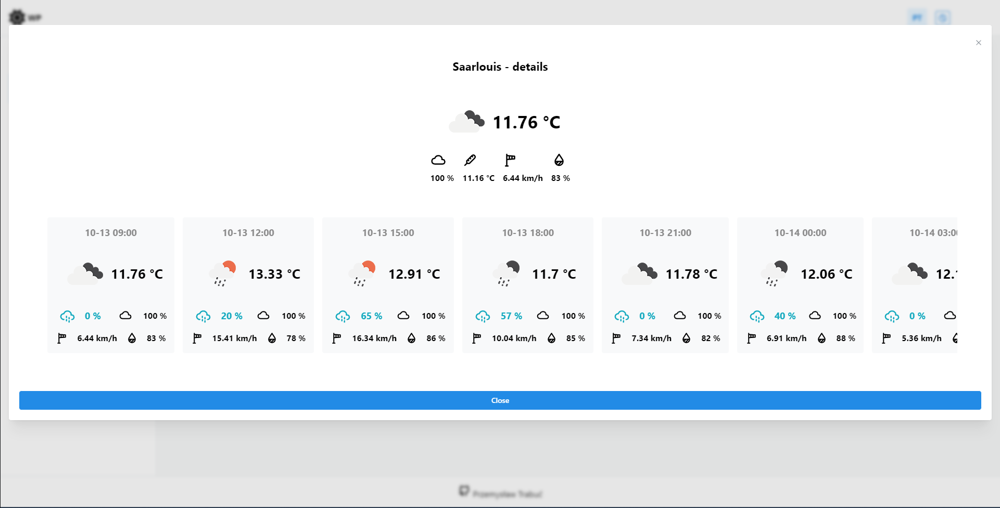
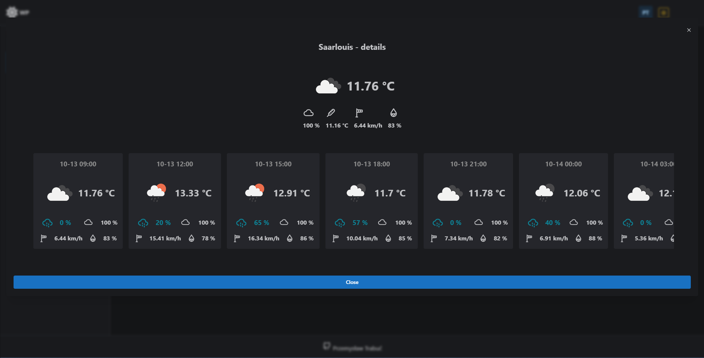

# Weather Panel

Weather application with logging and saving of user cities and management of users' favorite cities

## LIVE 
https://przemyslawtrabuc.github.io/weather-panel/
## Features

- Light/dark mode toggle
- searching city
- showing the city with the best and the worst weather
- weather
- forecast
- saving city for users
- sign in with google
- managing the order of cities
- saving settings and chat in local storage
- indicating if current city is on favourite list
- toast notifications of users' actions

## Tech Stack

**Client:** React, Redux, RTK, React Router, Mantine, Vite

**API:** OpenWeather https://openweathermap.org/api

## Screenshots

